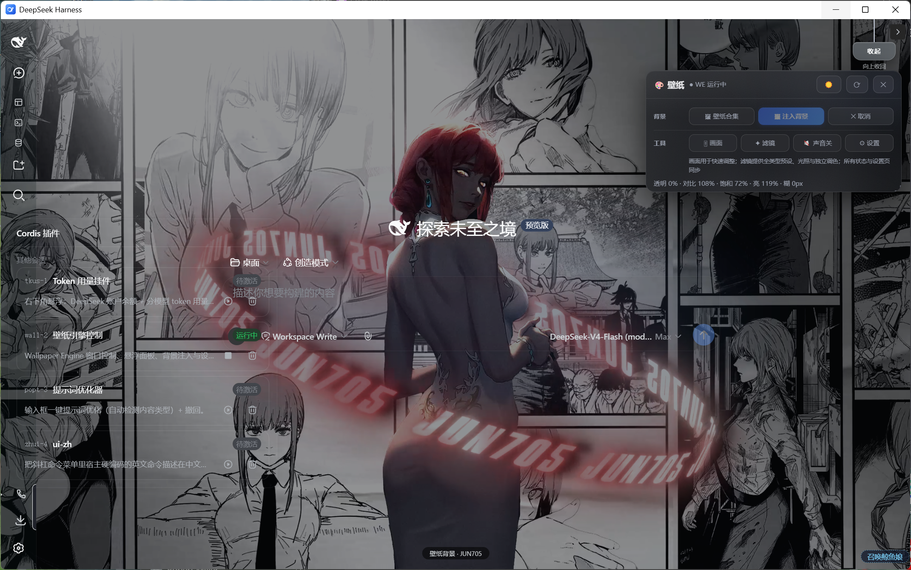
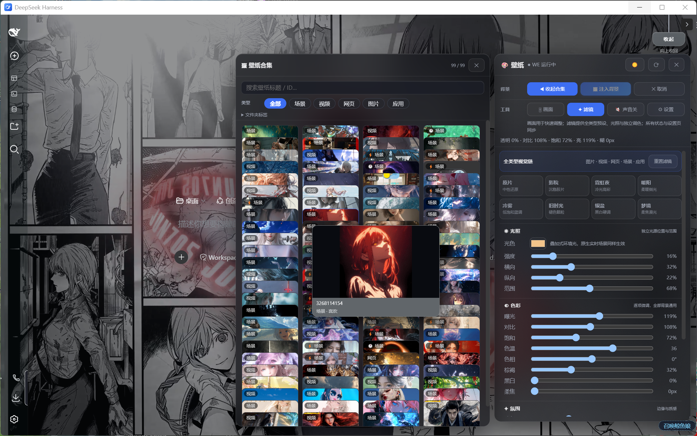
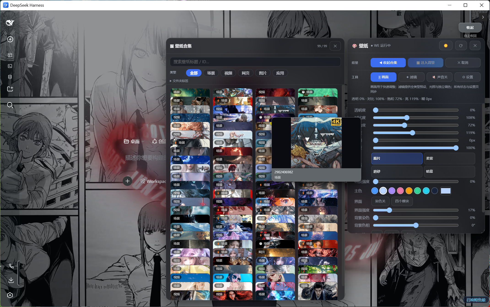
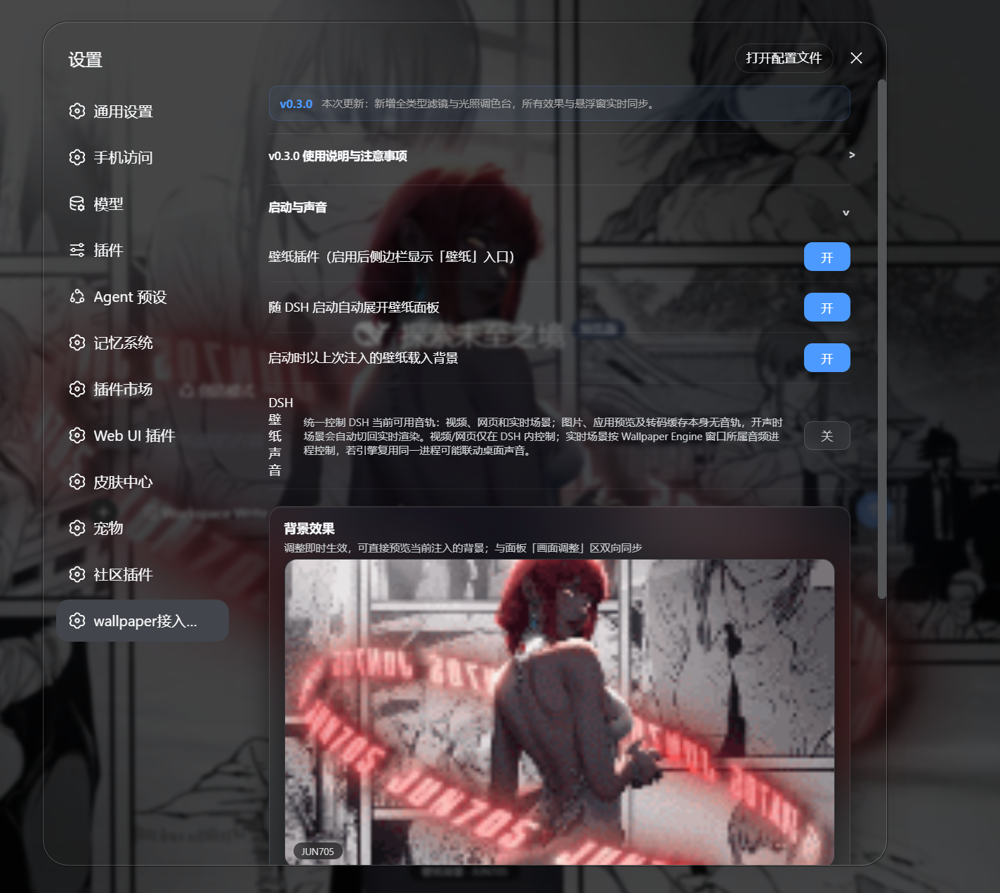

# DSH Wallpaper Bridge

将已安装的 [Wallpaper Engine](https://store.steampowered.com/app/431960/Wallpaper_Engine/) 接入 DeepSeek Harness（DSH）的 Cordis 插件。它提供壁纸集合、悬浮窗、背景注入、画面调节、材质/主色调、轮播清单和启动恢复等功能。

> Windows 专用。项目只控制以窗口方式运行的 Wallpaper Engine 内容；默认不会修改 Windows 桌面壁纸，也不会写入 Wallpaper Engine 的桌面壁纸分配。
>
> 本项目是独立开发的非官方兼容插件，不属于 DeepSeek、Steam 或 Wallpaper Engine，也未获得这些项目或公司的赞助、认可或背书。

## 项目说明

DSH Wallpaper Bridge 是本地桥接插件，不是壁纸资源库，也不替代 Wallpaper Engine。它读取当前电脑中已安装、且用户已拥有的 Wallpaper Engine 内容，并在 DSH 内提供统一入口：

- **浏览与控制**：按类型、来源与关键词筛选本机壁纸；支持预览、注入、取消、启动恢复和轮播清单。
- **界面体验**：提供 Cordis 侧栏入口、独立悬浮窗、设置页，以及画面、材质与主色调调节。
- **兼容边界**：图片、视频、网页类背景适合日常使用；场景类实时注入依赖原生环境，详见下方版本限制。

项目不会下载、解锁、分享或分发 Wallpaper Engine 的工坊资源。壁纸的授权、订阅与内容合规由使用者自行负责。

## 插件界面

插件以 Cordis 入口为中心工作：启动后在 DSH 侧栏提供“壁纸”入口，同时显示可收起的悬浮控制面板。用户无需离开当前会话，即可浏览本机壁纸、注入背景、切换声音并调整画面效果。

### 主面板与背景注入



### 本机壁纸集合与实时调节

壁纸集合只索引当前电脑中用户已安装的内容，可按类型搜索和筛选；右侧工具面板用于调节滤镜、光照、色彩与画面材质，效果会与设置页保持同步。

| 滤镜与光照 | 画面与材质 |
|---|---|
|  |  |

### DSH 设置页集成



> 截图中的壁纸和缩略图仅用于展示插件界面，来自截图设备上由用户自行安装的第三方内容，不包含在本仓库或 Release 安装包中。

## 版本状态

当前发布版本：**0.3.0**

### 0.3.0 更新

- 悬浮窗新增可展开的“滤镜与光照”调色台，内置原片、影院、霓虹夜、暖阳、冷雾、旧时光、银盐和梦境 8 套可继续微调的方案。
- 新增曝光、对比、饱和、色温、色相、棕褐、黑白、柔焦、RGB 通道、色罩、独立光源、暗角和颗粒调节；设置页同步提供相同模块。
- 图片、视频、网页、场景和应用预览共用同一效果状态；原生实时场景启用像素滤镜时自动叠加捕获效果层，恢复中性值后回到原生直出。
- 修复饱和度调整到 0 时被错误还原为 100% 的问题；自定义方案会保存完整的滤镜与光照参数。

### 0.2.5 更新

- 修复正常退出 DSH 后，DSH 专用实时场景窗口仍由 Wallpaper Engine 运行并继续播放音效的问题；桌面壁纸保持不变。

### 0.2.4 更新

- 悬浮窗操作按“背景 / 工具”重新分组，画面与设置模块互斥展开；壁纸合集改为可收起的侧向抽屉。
- 主面板与设置页共用同一声音状态，统一控制 DSH 视频、网页及实时场景的可用音轨；图片、应用预览和无音轨缓存保持静音。
- 静音场景优先命中转码缓存以加快切换；开声时自动使用实时场景，避免后台无音轨缓存覆盖。
- 移除悬浮窗“强制转码”入口，保留原有自动转码、缓存、轮播、画面调整和注入能力。
- 视频和网页声音仅在 DSH 内控制；实时场景按 Wallpaper Engine 窗口所属音频进程控制，若引擎复用进程可能联动桌面声音。

### 0.2.3 更新

- 悬浮窗改为界面顶部拉绳式展开，保留侧边栏入口和原有功能。
- 主操作、筛选、画面、音乐和设置按关联重排；非常用模块可展开收纳，设置页同步调整。
- DSH 背景音乐不调用 Wallpaper Engine 全局静音；视频和网页可在 DSH 内独立控制。
- 壁纸列表按插件会话复用；图片、视频和网页切换跳过无效场景清理，并发场景切换共用安全清理流程。

### 0.2.1 更新

- Cordis 壁纸插件改为 DSH 启动时单实例运行，所有对话共享同一份插件；新建或切换对话不再重复启动悬浮窗和设置项。
- 悬浮窗重新整理主操作按钮，并在背景音乐开关旁标明作用范围。
- 背景音乐开关只控制 DSH 内嵌视频/网页背景，不调用 Wallpaper Engine 全局静音，因此不影响桌面壁纸；原生实时场景暂不支持独立静音。

### 已可用

- Cordis 侧栏入口、插件悬浮窗、设置页和独立自动加载器。
- 图片、视频、网页以及 Wallpaper Engine 项目的发现、筛选、预览、手动注入与取消。
- 画面调节、材质、主色调、轮播清单和上次背景恢复配置。
- 完整安装包：安装独立的定制 DSH，不覆盖未知版本的既有 DSH。
- 安装后使用稳定运行目录，不依赖解压目录；更新时只迁移本插件的旧启动项，并备份被修改的本地配置。

### 已知限制 / 试验性能力

- **场景类（3D）壁纸的原生实时层仍是试验性能力。** 浏览器无法直接渲染 Wallpaper Engine 私有场景格式，因此依赖 Wallpaper Engine、原生桥接与显卡环境协作；不同 GPU、驱动、壁纸项目可能出现白屏、闪烁或不可用。遇到此类情况请取消注入或改用视频/图片壁纸。
- 场景实时层、沉浸式全屏需要使用本项目的**完整包**和配套定制 DSH；轻量安装只保证 Cordis 插件层的兼容性。
- 新设备必须自行安装 Wallpaper Engine，并登录拥有订阅的 Steam 账号，或复制自己拥有的本地壁纸文件。项目不会分发工坊内容。
- 不会迁移个人的壁纸清单、已选轮播清单、缓存、运行状态和本地路径；新设备安装后需要重新扫描、选择或导入自己的配置。

## 快速安装

### 推荐：完整包

完整包适合换设备或需要场景实时层、沉浸式全屏的情况。

1. 从 [v0.3.0 Release](https://github.com/vanhungbui-11/dsh-wallpaper-bridge/releases/tag/v0.3.0) 下载 `DSH-Wallpaper-Setup-Full-0.3.0.zip` 及对应 `.sha256` 文件。
2. 校验 SHA-256 后解压到任意临时目录，双击 `install.cmd`。
3. 安装器会复制独立 DSH、安装壁纸桥接文件、注册 Cordis 自动加载器，并创建 `DeepSeek Harness Wallpaper` 快捷方式。
4. 若已有 DSH 正在运行，关闭后从新快捷方式重新打开一次；若没有运行中的 DSH，安装器会直接启动它。
5. 打开 Cordis Plugin 面板，确认“壁纸引擎控制”运行中；侧栏和右上角的“壁纸”入口即可打开悬浮窗与设置页。

公开完整包已排除本机路径、账号配置、会话、日志、壁纸清单与缓存。包内的 DSH、Electron、Node.js 及其他依赖仍分别受其自身许可证约束。安装器不会覆盖正在运行的同一份独立 DSH；关闭它后再次运行安装器即可更新。

### 已有兼容 DSH：轻量安装

从源码目录或轻量包运行：

```powershell
./install.cmd
```

或：

```powershell
node install.js
```

轻量安装会把运行文件复制到 `%LOCALAPPDATA%\DSHWallpaperBridge\current`，并把插件注册到当前用户的 DSH 配置目录。重启 DSH 后生效。

### 从源码构建安装包

需要 Windows PowerShell 5.1+ 和 Node.js 18+：

```powershell
npm run check
npm run package:portable

# 完整包需要传入已验证的定制 DSH 目录
./release.ps1 -Full -HarnessDir 'D:\Path\To\DeepSeek Harness'
```

也可设置一次环境变量后执行 `npm run package:full`：

```powershell
$env:DSH_HARNESS_DIR = 'D:\Path\To\DeepSeek Harness'
npm run package:full
```

产物位于 `dist/`，该目录不进入 Git 仓库。

## 首次使用

1. 确认 Wallpaper Engine 已安装；必要时先在 Steam 中完成工坊订阅下载。
2. 在 DSH 中打开“壁纸”入口，使用分类、来源和搜索定位壁纸。
3. 单击卡片为手动注入；悬停可预览单张壁纸。
4. 在设置页中调整材质、主色调、画面参数和轮播。
5. 轮播使用“轮播清单”：勾选的项目才会参与，类型/来源筛选只用于快速选择。

## 技术方案

| 层 | 实现 | 职责 |
|---|---|---|
| 壁纸桥接 | Node.js `we.js` | 探测、扫描、列出、启动、关闭与控制 Wallpaper Engine 窗口。 |
| DSH Host | `dsh/plugin.host.js` | 向 Cordis 暴露壁纸工具、持久配置、原生桥接调用。 |
| DSH Client | `dsh/plugin.client.js` | 侧栏入口、悬浮窗、集合卡片、设置与视觉效果。 |
| 自动加载 | `dsh/wallpaper-bootstrap.js` | 基于代码摘要复用或更新本插件，不影响其他 Cordis 插件。 |
| 场景桥接 | `native-scene-bridge.js`、`we-tools/SceneLayerHost.cs` | 在完整定制 DSH 中提供原生场景层实验能力。 |
| 安装/发布 | `install.ps1`、`release.ps1` | 稳定安装、备份迁移、完整包与 SHA-256 校验。 |

## 目录清单

```text
.
├── we.js                         # Wallpaper Engine 控制 CLI
├── native-scene-bridge.js        # 原生场景桥接服务
├── install.cmd / install.ps1     # 一键安装入口
├── install.js                    # DSH 配置与稳定运行目录安装
├── release.ps1                   # 生成轻量包/完整包
├── package.json                  # 命令与版本
├── titles.json                   # 可公开的标题覆盖
├── docs/images/                  # README 插件界面截图
├── dsh/
│   ├── plugin.host.js            # Cordis Host 插件
│   ├── plugin.client.js          # 悬浮窗与设置 UI
│   ├── wallpaper-bootstrap.js    # 独立自动加载器
│   ├── install-bootstrap.js      # 安装与旧启动项迁移
│   └── check-*.js                # 无依赖回归检查
└── we-tools/
    ├── capture.cs / capture.exe  # Windows 窗口捕获工具
    ├── SceneLayerHost.cs         # 场景层原生 Helper 源码
    └── native-scene-lab.html     # 完整包随附的原生场景层页面
```

## 验证与排错

```powershell
npm run check            # 客户端、Host、自动加载器、安装迁移
npm run check:release    # 轻量发布包解压/安装/独立运行验证
node we.js detect        # 检查 Wallpaper Engine 发现结果
node we.js list          # 查看当前机器的本地壁纸清单
```

如果插件入口没有出现：先重启 DSH，再检查 Cordis Plugin 面板中“壁纸引擎控制”是否在运行。若 Wallpaper Engine 未被发现，先确认 Steam/Wallpaper Engine 已安装并完成本机订阅下载。

## 隐私与安全

### 本地数据与网络边界

- 插件在本机扫描 Wallpaper Engine 安装目录与用户已下载的壁纸，用于生成本机清单；该清单默认保存在本机，不上传到仓库或 Release。
- 本项目不要求填写 Steam、GitHub、DSH 或 Wallpaper Engine 的账号密码、Cookie、API Key 或 Token；原生场景桥接仅在本机 `localhost` 通信。
- 项目本身不提供遥测、分析或云端同步服务。DSH、Steam、Wallpaper Engine 与 GitHub 的网络行为分别受其自身的隐私政策约束。

### 不公开的文件

以下内容已在 `.gitignore` 与发布脚本中排除，提交前仍请自行复核：

- `wallpapers.json`、`runtime.json`、`we.config.json`、`titles.local.json`、转码缓存和安装备份；
- Steam/DSH 会话数据、Cookie、Token、聊天内容、用量记录和运行日志；
- 本机绝对路径、Wallpaper Engine 工坊资源、本地导入壁纸，以及用户自己的 DSH 配置与会话数据。

### 本机修改范围

- 壁纸控制使用 Wallpaper Engine 的窗口模式，并只管理 `dsh-we-*` 命名的窗口；默认不修改 Windows 桌面壁纸或 Wallpaper Engine 的桌面分配。
- 安装器只写入本插件的稳定运行目录与 DSH 插件配置；迁移旧启动项前会创建备份。建议在更新前关闭正在运行的 DSH，并保留备份直到确认运行正常。

如需分享截图、日志或配置，请先移除用户名、绝对路径、壁纸标题、工作区名称和会话内容。

## 许可证

本仓库自行编写的桥接代码采用 [MIT License](LICENSE)。完整安装包内的 DSH、Electron、Node.js 与其他第三方依赖遵循各自随附的许可证与版权声明，详见 [THIRD_PARTY_NOTICES.md](THIRD_PARTY_NOTICES.md)。

## 作者

**vanhungbui-11** — [GitHub: vanhungbui-11/dsh-wallpaper-bridge](https://github.com/vanhungbui-11/dsh-wallpaper-bridge)
